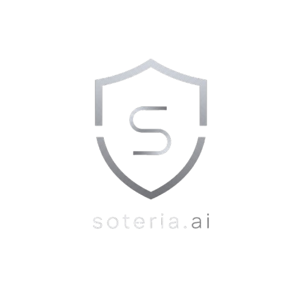

# soteria.ai v0.1 Alpha "Aegis"
Intelligent Cyber Safety Assistant for the Age of AI 

### Competition Theme
Cyber Safety in the Age of AI 
Category: Software Project 
Developed by: Jyotiraditya Biswas & Avidaan Dubey from The Orchid School

## How to Install and Run?
## Step 1
Install Repository as ZIP file from GitHub if not already, and unzip into somewhere it is easily visible.

## Step 2
__Skip this step if Python 3.11+ and pip is already installed on your machine.__  
You need:
- Python 3.11+
- pip
- A stable internet connection to connect to APIs and download necessary packages.

### Python
- Visit [The Official Python Download Page](https://www.python.org/downloads/) to download Python on your machine.
- Run the installed .exe file to open the installation window.
- _Make sure to check both "Use admin privileges" and "Add python.exe to PATH" boxes._
- Click "Install Now"
- To confirm installation, open command prompt and enter `python --version`. It should output something like "Python 3.xx.xx"

### pip
- Open command prompt and run `curl https://bootstrap.pypa.io/get-pip.py -o get-pip.py` to download the installer script.
- Run `python get-pip.py` to execute the installer script using Python.
- Wait a few moments till pip installs on your machine.
- Run `pip --version` to confirm installation. it should output something like 'pip xx.x.x from ...'

## Step 3
Open Command Prompt for Windows, and type this command: 
`cd PATH-TO-SOTERIA-FOLDER` 
Make sure to replace PATH-TO-SOTERIA-FOLDER with the folder path you downloaded.

## Step 4
Run `python setup.py`. This will start installing are needed packages. If successful, it would output something like: 
`Soteria has been installed successfully!` and `Welcome to Soteria!`

## Step 5
Almost there! We have installed everything needed, now its time to run it. 
Run `python app.py` to start the application. Wait a few moments until you see something like: 
`* Running on http://127.0.0.1:5000` 
Click on the link while holding Ctrl on your computer, and the application will pop up on your screen.

## 1. Project Overview
Soteria is an intelligent cybersecurity assistant designed to protect users from modern cyber threats amplified by AI. It combines rule-based analysis with AI-assisted threat evaluation to identify phishing emails, scam chats, fake websites, weak passwords, deepfakes and privacy risks. Unlike traditional tools, Soteria explains why something is dangerous, helping users learn while staying safe.

## 1.1 Why the Name 'Soteria' and Codename 'Aegis'?
The name 'Soteria' comes from Greek mythology, where Soteria represents safety, preservation and protection from harm. Just as Soteria symbolizes keeping people safe from danger, this project aims to protect users from AI-powered cyber threats.  

The codename 'Aegis' is also derived from Greek mythology. The Aegis is a magical and impenetrable shield, primarily carried by Zeus and his daughter Athena. Aegis refers to the shield in our logo to signify security and safety.

## 2. Problem
AI has made phishing, deepfakes, voice cloning and social engineering more convincing and easier to fall for. Many users cannot identify these threats before becoming victims.

## 3. Objectives
- Detect phishing attempts
- Identify fraudulent websites
- Analyze scam conversations
- Evaluate password strength
- Detect possible deepfake images
- Scan for exposed personal information
- Educate users about cyberscams

## 4. Target Users
Today, cyberscams are highly common, and anyone can be targetted, especially elderly people, who do not have much awareness about these frauds. 

## 5.Software Architecture

## 6. Dashboard
The dashboard is the main hub of the app. It contains quick actions on a sidebar, a search bar and information about Soteria.

## 7. Email Scanner
This module looks for phishing links and patterns, urgency, the sender's email address and grammar. 
There are three ways you may upload an email's content:
- Paste the content through the general clipboard into the textbox.
- Upload a .eml file which is downloadable for each email on Gmail.
- Directly look for recent emails in your inbox using the Gmail API provided by Google Cloud. You need to sign in through Google's official login page to your Google account to access your recent emails.  

## 8. Website Checker
Website Checker analyzes URLs for HTTPS, lookalike domains, suspicious keywords, recent domains and phishing indicators.

## 9. Chat Scam Detector
Chat Scam Detector analyzes chats from WhatsApp, Discord, SMS and similar platforms. Detects urgency, manipulation, OTP requests, payment requests and impersonation.  
There are two ways you may upload a online conversation:
- Paste the content through the general clipboard into the textbox.
- Upload a screenshot of the chat. Using OCR(Optical Character Recognition), Soteria will convert these messages into readable text while ignoring extra labels such as time of message sent, "Sent", "Read", "Seen", etc.

## 10. Deepfake Detector
Deepfake Detector uses OpenCV to look for artifacts, along with Gemini for overall detection. Probability of the image being a AI-generated image is presented in percentage, with 100% being a definitely AI-generated image and vice-versa.  
__NOTE: This module is still prototypical. Results are not guaranteed to be correct every time.__

## 11. Password Analyzer
Password Analyzer evaluates password complexity, dictionary words, patterns and estimated crack time. 
_This evaluation involves zero use of third-party AI services to ensure user privacy. Scroll to Point 20 to know more about our privacy policy._

## 12. Privacy Scanner
Privacy Scanners can accept different types of file formats such as PDF, DOCX, PY, CSV, TXT and more.  
The aim of this module to look for sensitive information such as API tokens, Personal emails, Possible Passwords, etc. 
_This evaluation does not involve direct use of third-party AI services to ensure user privacy. Scroll to Point 20 to know more about our privacy policy._
__Work In Progress..__

## 13. Threat Analysis Engines
Our local threat analysis engines combine rule-based scoring with AI-assisted reasoning(if needed) to generate an explainable risk score and recommendations.

## 14. AI Logic
Uses transparent rules plus AI-assisted analysis so users understand why a threat was flagged. AI is only used when needed, and recieves minimum information to ensure user privacy. _Scroll to Point 20 to know more about our privacy policy_

## 15. Technology Stack
### Backend
- Python
- Flask

### Frontend
- HTML
- CSS
- JavaScript

### AI
- Google Gemini
- OpenCV

### Libraries
- Pillow
- NumPy
- python-dotenv

### Database
- SQLite(Used for storing History of the user)

## 16. User Workflow
Open dashboard > Choose module > Enter data > Threat analysis by local engines along with AI if needed > Risk score > Explanation > Recommendations > Save history.

## 17. Future Improvements
Voice scam detection, browser extension, live monitoring, mobile app, cloud sync, AI chatbot assistant.

## 18. Why This Project Is Different
Instead of only blocking attacks, Soteria teaches users why something is dangerous and how to avoid similar attacks in the future.

## 19. Demo Plan
Demonstrate phishing detection, scam chat analysis, website checking, password evaluation, deepfake prototype, privacy scan and explain the transparent AI logic.

## 20. Our Privacy Policy
Soteria is designed to be a _privacy-first_ application. Whenever possible, we ensure that analysis is done locally on the user's machine, minimizing the amount of information sent to third-party AI services.  
- __The Password Analyzer__ specifically targets this issue by using a local engine instead of AI, so the password never leaves their device.
- __The Privacy Scanner__ only sends the quantity of threats found. For example, it would only send "Passwords Found: 3, Emails Found: 2" instead of sending the whole uploaded file. The detection of sensitive information is handled by a local engine, so the file never goes to a third-party service.
- __Other AI-assisted__ modules only send minimum information necessary to generate an explanation or risk assesment.

Our goal is to help users stay safe and ensuring sensitive information stays on their device whenever possible.